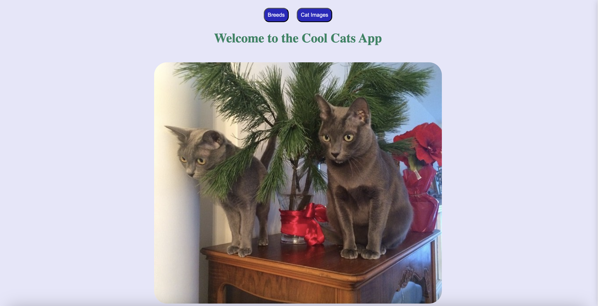
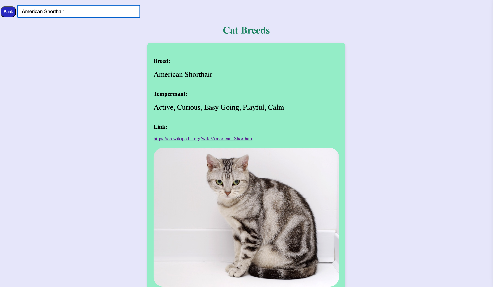

# CTD-Cat-Pre-Work

I utilized the CatAPI to do my prework assignment. To use more of the API I made a basic server file because I wanted to hide my API Key to be secure. You will see in previous commits I used a key in the top of my `script.js` file to get the images to show but after I refactored I went back and got a new key so no one can mess with the api key. 

The 2 data models I used was random cat images being displayed on one page and a breed card being displayed on another page. 

## CatAPI
To get an API key for your `.env` file click on the get free access button and enter in your info to recieve an email with the API key.
[Get Your API Key](https://thecatapi.com/#pricing)

## Installation

Getting Started

1. Clone your repository locally
2. Run `npm install` to install all the dependencies
3. Setup your `.env` file locally. In particular, you will need to setup `PORT` and `CAT_API_KEY` environment variables.
4. Run `npm run dev` to run locally

## Deployed Site

[Cool-Cats](https://cat-breed-app.onrender.com/)
## Images Of Cat Site
Main Page:

Breed Page:

Images Page:
